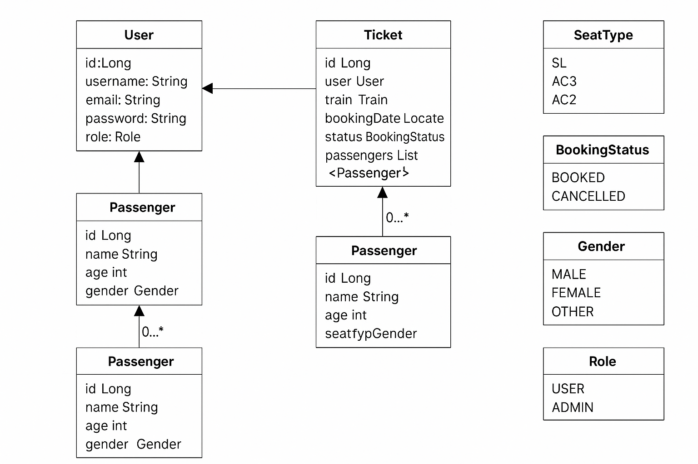

Here's your complete, polished `README.md` for the **Java CLI Ticket Booking System** — tailored for GitHub and resume visibility:

---

```markdown
# 🎟️ Java CLI Ticket Booking System

A Command-Line Interface (CLI) based **Ticket Booking System** built using Java and JSON. It supports **user authentication**, **train search**, **ticket booking**, and more — with a modular architecture and clean, maintainable code.

---

---

### 🗂️ Project Structure

```plaintext
ticket-booking-cli-java/
├── app/
│   ├── src/
│   │   ├── main/
│   │   │   ├── java/
│   │   │   │   ├── ticket/
│   │   │   │   │   ├── booking/
│   │   │   │   │   │   ├── App.java                   # CLI runner
│   │   │   │   │   │   ├── entities/                  # Domain models: User, Ticket, Train
│   │   │   │   │   │   └── services/                  # Business logic services
│   │   │   ├── localDb/
│   │   │   │   ├── users.json                         # User data (JSON)
│   │   │   │   └── trains.json                        # Train data (JSON)
│   ├── test/
│   │   └── java/                                      # Unit tests (Optional)
├── gradle/, gradlew*                                  # Gradle build config
├── LLD.png                                            # UML / Architecture diagram
└── README.md                                          # Project documentation
```

---


---

## 🔐 Core Features

| Feature         | Description                                                  |
|----------------|--------------------------------------------------------------|
| 👤 Sign Up       | Create new user with hashed password (BCrypt)                |
| 🔐 Login         | Authenticates existing user securely                         |
| 🚆 Search Trains | Find trains by source & destination                          |
| 🧾 Book Ticket   | (Coming Soon!) Reserve a train seat                          |
| 📄 Fetch Bookings| View tickets booked by logged-in user                        |
| ❌ Cancel Ticket | Cancel ticket by ticket ID                                   |
| 💾 JSON Storage  | Stores user & ticket data locally using Jackson              |

---

## 💡 Tech Stack

- **Java 17+**
- **Jackson Library** for JSON DB
- **BCrypt** for password hashing
- **OOP principles** for architecture
- **CLI-based navigation** using Scanner

---

## 🖼️ Screenshots



---

## 📄 Sample Users (users.json)

```json
{
  "prakhar@gmail.com": {
    "name": "Prakhar",
    "password": "$2a$10$abcxyz...", // Hashed
    "email": "prakhar@gmail.com",
    "tickets": []
  }
}
````

---

## 📈 Future Enhancements

* ✅ Implement `bookTicket()` logic
* 🧪 Add JUnit test cases
* 📤 Export ticket as PDF/print
* 🖥️ GUI version using JavaFX
* ☁️ Move to MySQL/AWS for real DB integration

---

## 🚀 Getting Started

```bash
# Clone this repo
git clone https://github.com/gurawliprakhar/ticket-booking-cli-java.git
cd ticket-booking-cli-java

# Compile & run the app
javac App.java
java App
```

---

## 📄 Resume Highlights

* ✅ Built a complete Java project with CLI & local DB
* ✅ Implemented secure login using BCrypt
* ✅ Designed modular architecture using OOP
* ✅ Used JSON files to simulate database operations
* ✅ Wrote clean, testable, maintainable code

---

## 🙋‍♂️ Author

**Prakhar Tripathi**
🔗 [GitHub](https://github.com/gurawliprakhar)
📧 [gurawliprakhar@gmail.com](mailto:gurawliprakhar@gmail.com)

---

## 🪪 License

This project is licensed under the MIT License. Feel free to fork and use for learning.

```

---

```
